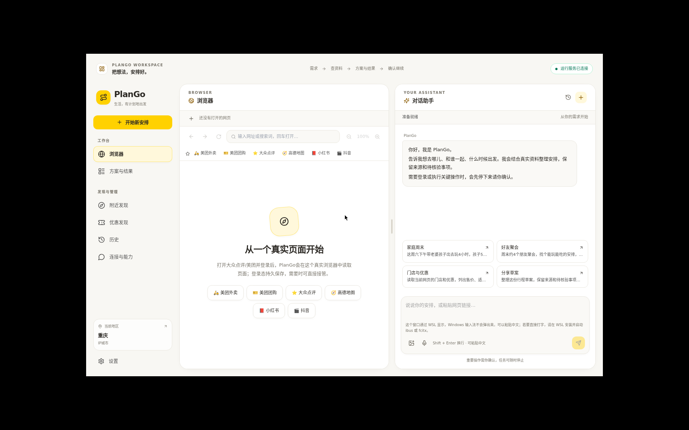
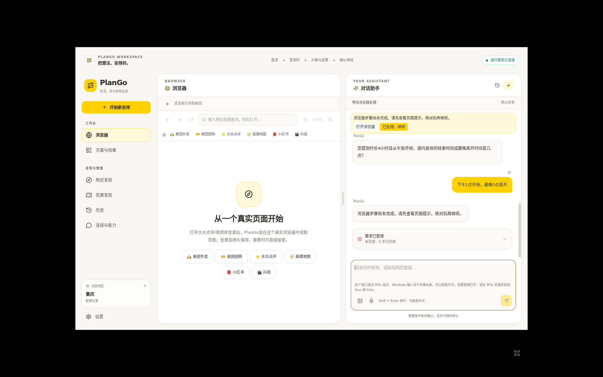
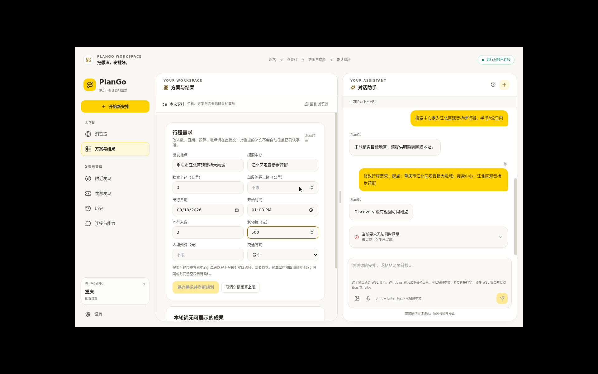
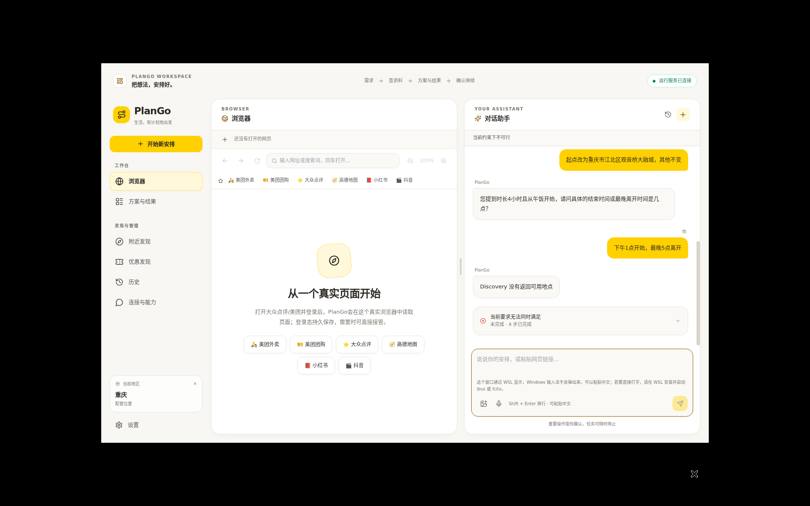
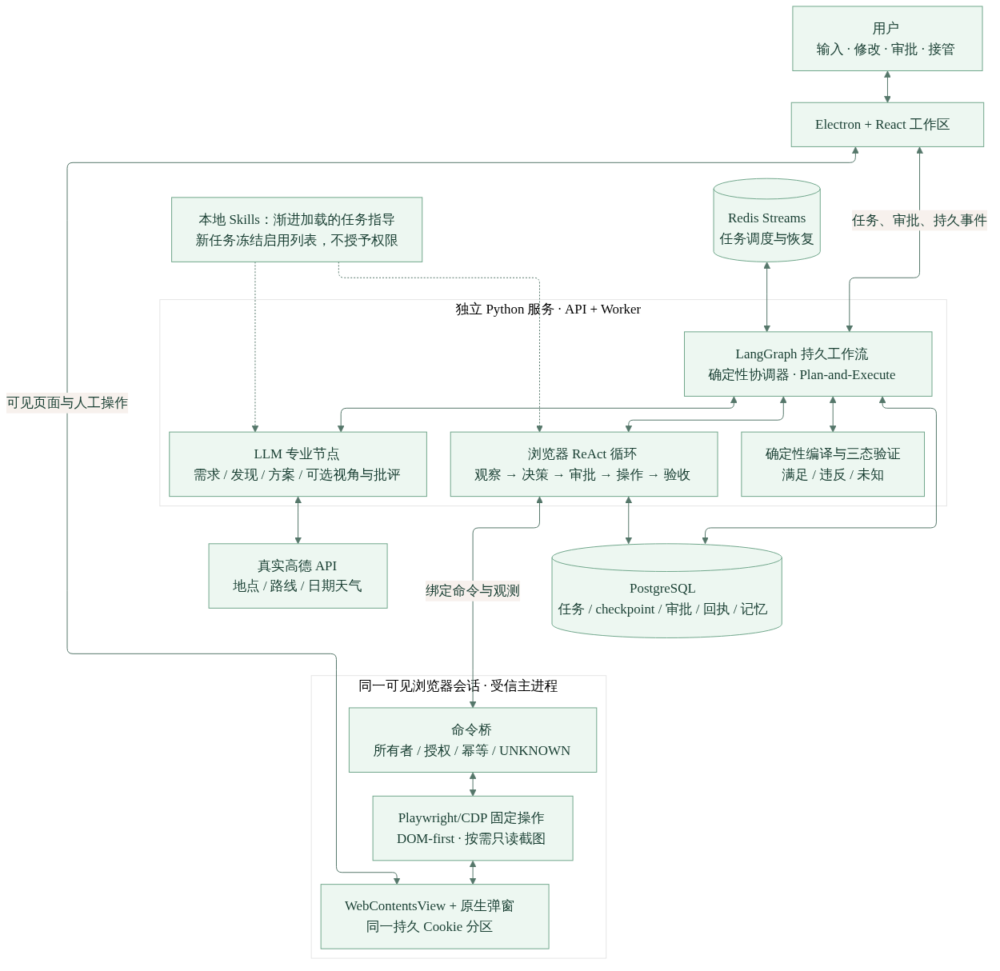

# PlanGo

**可恢复的本地生活规划 Agent** —— 驱动真实浏览器读取门店与优惠，每个结论保留来源与未知项，任务中断后可继续。

Electron 桌面 × Python Harness（FastAPI / PostgreSQL / Redis / worker）× 高德开放平台



## 它能做什么

- **真实浏览器受控执行**：导航、滚动、输入、点击；登录页与验证码暂停等待人工接管；每步操作绑定页面快照与参数，全程可核对。
- **结构化需求与优惠比较**：同一任务内修改人数、日期、预算并重新规划；面值、售价、原价分列，不适用原因与缺失规则直接可见。
- **证据链与诚实边界**：网页、菜单、优惠都带来源；缺价保持未知，套餐总价不当人均，未确认结果不写成完成。
- **可恢复任务**：发送中断可"核对送达并取回"原任务；重启后接续同一任务与累计预算。
- **独立质量评测**：TSR / Faithfulness 双指标，出题、金标独立评审、评分器演进全留痕。

## 界面一览

| | |
|---|---|
|  |  |
| 从真实网页或场景开始一次安排 | 大众点评 / 美团 / 高德在应用内真实打开并读取 |
|  |  |
| 浏览器步骤逐个人工核对后继续 | 结构化需求卡：人数/日期/预算/地点在此修改并重新规划 |
|  |  |
| 基于高德的周边真实门店发现（带来源与定位说明） | 连接、模型与能力范围透明可核 |
|  | |
| 约束不可行时如实说明，不伪造方案 | |

## 质量评测

独立评测体系见 [eval/trustworthy-v1/](eval/trustworthy-v1/README.md)（204 题 holdout 金标经独立会话评审接受，出题、审阅、评分器演进全留痕）：

| 指标 | 最终结果 |
| --- | --- |
| TSR 任务成功率（程序化 0/1 判定） | **0.966**（Wilson 95% CI [0.931, 0.983]） |
| Faithfulness 事实支持率（规则层 + LLM-as-Judge，作答层） | **0.957**（bootstrap 95% CI [0.937, 0.974]） |

批次分数以 `output/trustworthy-v1/` 报告原件为准，重评不重跑；指标为 provisional_holdout（评委与被测同模型），official 还差一次独立 runner 审计。

## 架构



外层是集中式 Plan-and-Execute 工作流，页面内是受控 ReAct 循环；确定性协调器、LLM 专业节点与领域服务职责分离。任务闭环见[任务生命周期图](figures/plango-task-lifecycle.md)，固定决策见[架构决策](docs/架构决策.md)。

```text
src/renderer/            产品界面与展示投影（React + Zustand）
src/main/                桌面壳层：后端连接、受信浏览器驱动（WebContentsView + CDP）
backend/plango/          浏览器、业务、审批、记忆与提醒扩展（FastAPI + worker）
vendor/plango_harness/   固定 Harness：规划图、执行器与上游基线
eval/ + scripts/         可信评测体系与评分器
```

## 快速开始

**① 试用包（Linux / WSLg，推荐）** —— 从 [Releases](https://github.com/LittleSongxx/PlanGo/releases) 下载 `plango-0.1.0-linux-x64-trustworthy-v5.tar.gz`，下载即用，不需要 Node/conda：

```bash
sha256sum -c plango-0.1.0-linux-x64-trustworthy-v5.tar.gz.sha256
python3 plango-unpack/scripts/trial.py install plango-0.1.0-linux-x64-trustworthy-v5.tar.gz \
  "$HOME/.local/share/plango-trial" --project plango-trial --port 18021
```

详见[试用安装](docs/试用安装.md)（安装、配置、诊断、升级与冷备份恢复）。

**② 源码运行** —— 需要 Node.js 22.12+、conda、uv、Docker 与桌面环境：

```bash
./start.sh    # 一键：依赖、plango 环境、Docker 服务就绪、后台启动桌面
./stop.sh     # 停止桌面与容器，保留数据卷
```

在 `.env` 填写模型（OpenAI 兼容端点）与高德 Key（模板见 `.env.example`；`npm run setup:backend` 自动生成缺失 token 与数据库密码）。手动分步：`npm ci && npm exec -- install-electron --no && npm run setup:backend && npm run services:up && npm run dev`。

**③ 云端在线演示** —— [deploy/aliyun/](deploy/aliyun/README.md)：一台阿里云 ECS 十分钟拉起完整桌面（noVNC 网页遥控），按需演示形态，已本地端到端验证。

## 配置要点

| 变量 | 作用 |
|---|---|
| `OPENAI_API_KEY` / `OPENAI_BASE_URL` / `OPENAI_MODEL` | 模型配置（OpenAI 兼容端点） |
| `AMAP_WEBSERVICE_KEY` / `AMAP_JS_KEY` / `AMAP_JS_SECURITY` | 高德 Web 服务 / JS 地图凭证 |
| `PLANGO_BACKEND_URL` / `PLANGO_BACKEND_TOKEN` | 桌面连接的后端地址与共享 token |
| `PLANGO_MAX_MODEL_TOKENS` / `PLANGO_MAX_TOOL_CALLS` / `PLANGO_MAX_RUN_SECONDS` | 每次输入的有界预算（默认 12000 / 48 / 300） |
| `PLANGO_RUNTIME_PROFILE` | `desktop` 本地 SQLite；Compose 固定 `service` |

完整变量见 `.env.example` 与[设计文档](docs/设计文档_PlanGo.md)。

## 能力边界（如实声明）

- 登录、验证码与所有关键页面操作由人工确认；审批绑定任务轮次、页面快照与参数。
- 未确认结果保持 `UNKNOWN`，不会自动下单；通用"成功"文案不能证明商家、金额与履约正确。
- 真实商家履约、支付、任意网站表单不在能力内；正常运行不用模拟数据补齐流程。
- Cookie 留在本地持久会话分区；使用远程模型时对话与网页片段会发送至所配置的模型服务。
- 独立试用验收尚未完成（[验收记录](docs/独立试用验收.md)）；质量成绩以评测体系为准，不把局部演示当成全部完成。

## 检查与验收

```bash
npm run setup:backend -- --dev
npm run check            # 类型、UI/传输/分享回归、Python 回归与构建
npm run test:independent # 独立验收检查
```

真实 Chromium/Electron 页面另有 `test:browser*` / `test:desktop` / `test:deployed` 系列（见 `package.json`）；部署恢复门禁为 `scripts/check_service_recovery.py`，CI 沿用此门禁。

## 文档

[设计文档](docs/设计文档_PlanGo.md) · [架构决策](docs/架构决策.md) · [3 分钟 Demo](docs/Demo脚本_3分钟.md) · [试用安装](docs/试用安装.md) · [评测体系](eval/trustworthy-v1/README.md) · [上游维护](vendor/plango_harness/SNAPSHOT.json)

---

> **English summary** — PlanGo is a resumable local-life planning agent: an Electron desktop app driving a real embedded browser, backed by a Python harness (FastAPI/PostgreSQL/Redis). Every delivered claim keeps its source link and explicit unknowns; tasks survive interruption and restart. Independently reviewed eval: TSR 0.966 / Faithfulness 0.957. All screenshots are from the current build.
