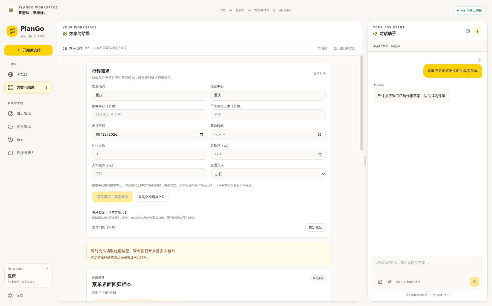

# 暂不可用提示修复

2026-09-09；实现 `b55371d`，实际桌面回归及导入兼容 `a7b8b53`。

截图中的长文本是内部格式校验异常被直接显示到界面。当前改为“暂时无法读取优惠信息。请重新打开来源页面核对。”；只有存在已选优惠记录时，才说明原选择仍保留。不会把读取失败解释为优惠已经过期。

修复放在共用展示边界 `src/shared/userMessages.ts`，覆盖聊天与历史、送达提示、优惠、浏览器、发现、设置、分享和操作记录。后台优惠投影也返回中文，因此旧客户端不会收到这一字段的校验详情。日志只记异常类别、字段位置和类型，不包含校验输入、凭据或供应商响应正文。

未送达、已接收待取回、送达待核实分别提示；不确定操作要求先核对实际记录。原请求身份、409冲突、审批和UNKNOWN机制保持原协议，展示转换不修改持久状态。普通回答、用户输入及正常来源引用保留。

验证见 [verification.json](verification.json)：双端类型检查、UI/发送恢复/运输回归、构建、隔离SQLite API投影、Ruff和mypy通过。实际Electron/WCV/IPC受控回归再次注入旧后端校验错误，页面无内部文本，原优惠与保存草案保留；测试窗口已关闭，未访问商家、未调用模型。

主API/worker已更新并核对源码hash。更新前有SQL一致性备份，原17业务表1413行、3个Cookie/身份/回执文件保留，未决命令及UNKNOWN为0；详见 [连续性核对](main-continuity.json)。私有备份位于 `output/friendly-errors-main-20260909/`，未重建数据库或试用安装包。

此次修改在30例质量输出封存后合入。质量审核继续使用原版本的不可变输出包，没有用新版界面重新渲染旧输出或覆盖原失败。
