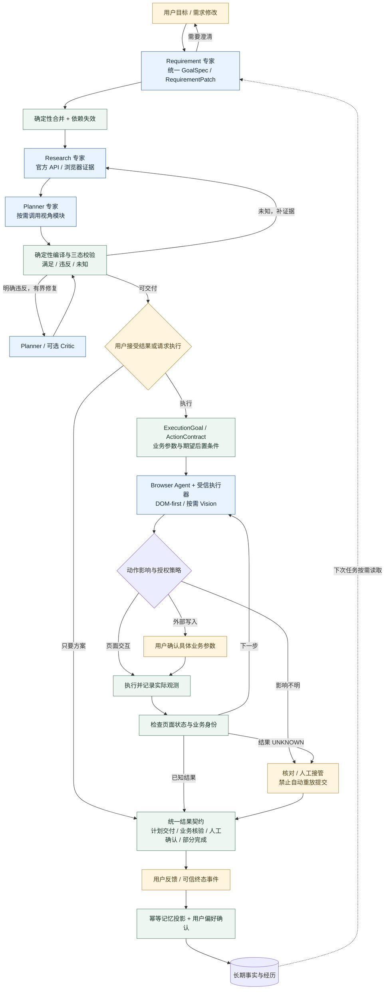

# 目标工作流：待实施建议

这是建议架构，除浏览器方向外尚未成为用户确认选型，也不代表已经实现。蓝色为 LLM 专业节点/工具 Agent，绿色为确定性机制或服务，黄色为用户交互。图中节点不应全部称为 Agent。

注：所有重试、补查与修复受预算和停止条件约束；全局错误/取消路径在此语义摘要中省略。

## 图形复核

评分仅针对图形的语义、箭头与可读性，不是项目成熟度评分。

- [x] 原始 `.mmd` 与本文 Mermaid 代码一致；Mermaid CLI 11.17.0 渲染成功。
- [x] 已查看实际 PNG，核对每条箭头方向和目标；当前图与建议图分开标注。
- [x] 角色、确定性服务、人工交互与断点标签均与对应说明一致。
- [x] 主流程、澄清/修复回环和反馈边界完整；全局预算/错误路径的省略已说明。
- [x] 白底、克制配色、中文文字可读，无重叠遮挡关键标签。

问题与修正：当前图第一版的浏览器自环标签被终态块遮挡，已收进子流程说明；补齐需求澄清边。目标图补齐影响不明时的接管路径，避免误画成直接执行。

Score: 9/10。Verdict: ACCEPT。纵向主流程较长，适合文档滚动阅读；可用 Mermaid 预览缩放。

复现：`npx -y @mermaid-js/mermaid-cli@11.17.0 -i figures/yoyu-target-workflow.mmd -o figures/yoyu-target-workflow.png -b white`。本次使用本机已有 headless Chromium，通过 Puppeteer 配置指定路径；其他环境需准备 Puppeteer 浏览器。
